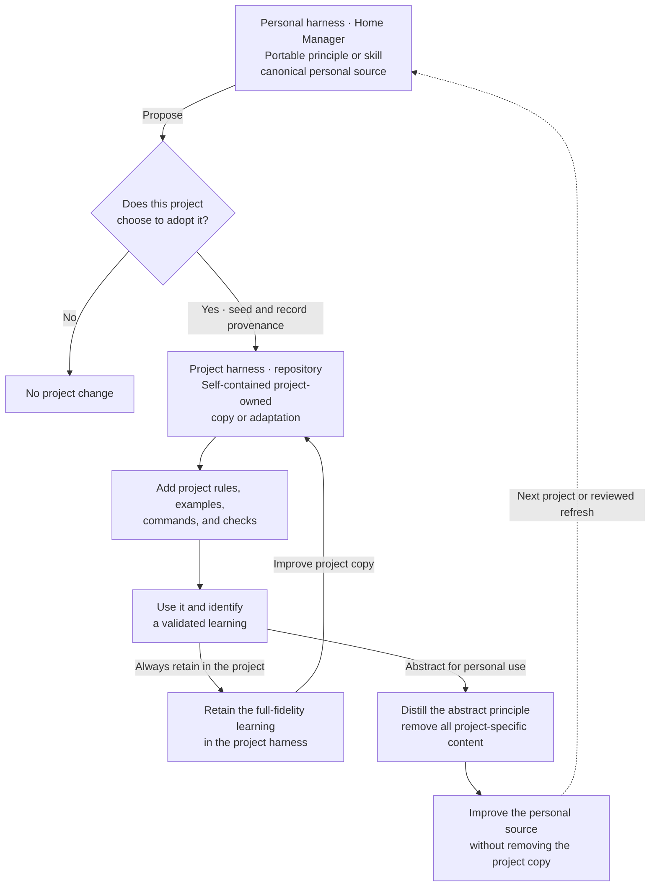

# Agent Harness Skill Lineage

This diagram shows how a portable personal capability can benefit a project while both owners retain an independent, useful version. It is human-facing documentation and is intentionally kept outside the agent-loaded skill instructions.

Every validated project learning follows both paths. The project retains the full-fidelity learning in its own harness. The personal harness receives a new abstract representation that contains no project-specific content. Authorization is not a decision point in this loop; abstraction is the boundary.

The personal source survives loss of project access. The project-owned version survives a contributor's departure and can start as an identical snapshot or an immediate adaptation. Secrets, confidential knowledge, private identifiers, and proprietary project details remain in the project. When frequent synchronization makes two independent copies expensive, move the shared core to a neutral source that both owners can review.

## Portable capability inventory

| Personal owner | Portable responsibility |
|---|---|
| `skills/elixir-otp-engineering/` | Elixir, OTP, Ecto, concurrency, side effects, tests, and documentation |
| `skills/phoenix-ui-architect/` | Phoenix presentation architecture, HEEx, forms, components, and layout |
| `skills/phoenix-liveview-resilient-ux/` | LiveView latency, concurrent events, recovery, uploads, and asynchronous work |
| `skills/accessible-web-interactions/` | WCAG 2.2 AA interaction design and practical accessibility evidence |
| `skills/semantic-web-inputs/` | Context-authoritative localized inputs and resilient browser editing |
| `skills/playwright-reactive-ux-testing/` | Temporal and state-boundary testing for reactive interfaces |
| `skills/ui-ux-design/` | Visual hierarchy, responsive composition, motion, and task efficiency |
| `skills/adapt-business-ux/` | Progressive business workflows and context-aware operational UX |

These personal packages deliberately omit originating modules, commands, paths,
product vocabulary, domain policy, provider decisions, locale defaults, and
scenario-specific selectors. Their technical claims use primary upstream
documentation and generalized implementation evidence.

Refresh flows in one reviewed direction at a time:

1. Retain a validated learning in the project skill, project documentation,
   regression, or deterministic check.
2. Distill only its project-neutral principle into the personal owner.
3. Treat later improvements to a personal skill as proposals for project
   review. Never overwrite the project package automatically.

This split is intentional duplication across independent ownership boundaries,
not an implicit alias. Each project must work without Home Manager, and each
personal package must work without repository access.
