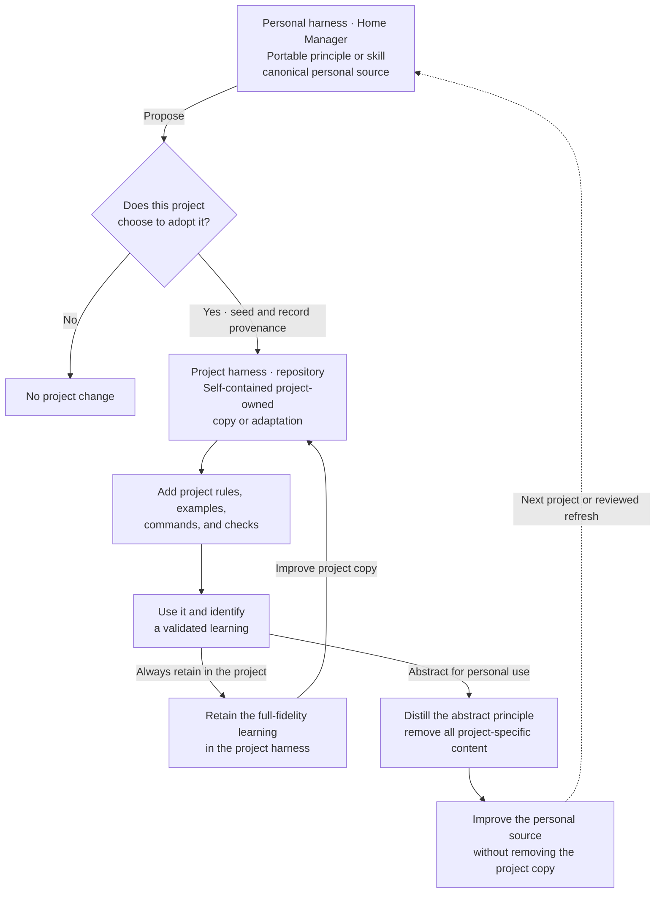

# Agent Harness Skill Lineage

This diagram shows how a portable personal capability can benefit a project while both owners retain an independent, useful version. It is human-facing documentation and is intentionally kept outside the agent-loaded skill instructions.

Every validated project learning follows both paths. The project retains the full-fidelity learning in its own harness. The personal harness receives a new abstract representation that contains no project-specific content. Authorization is not a decision point in this loop; abstraction is the boundary.

The personal source survives loss of project access. The project-owned version survives a contributor's departure and can start as an identical snapshot or an immediate adaptation. Secrets, confidential knowledge, private identifiers, and proprietary project details remain in the project. When frequent synchronization makes two independent copies expensive, move the shared core to a neutral source that both owners can review.
